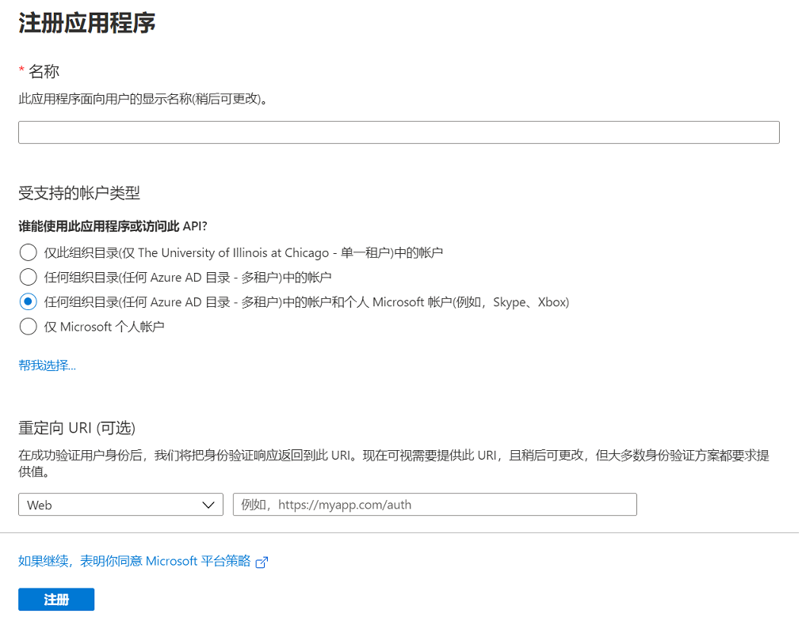

# OneDrive API

API 有两种，分别是 `flask-jsonrpc` 和 `flask route`。

> **注意：**
> 本文中提到的管理员指的是本项目搭建的服务的管理员

## 先决条件

向 Microsoft 标识平台注册应用程序，[点击这里](https://docs.microsoft.com/zh-cn/graph/auth-register-app-v2?view=graph-rest-1.0)。更多 api 请查阅 [微软官方文档](https://docs.microsoft.com/zh-cn/graph/api/resources/onedrive?view=graph-rest-1.0)


## 用户验证

可以验证多个微软账户

### 获取登陆 url

- 方法：`Onedrive.getSignInUrl`
- 需要管理员：是
- 参数
  | 名称 | 必要 |
  | --- | --- |
  | `app_id` | 是 |
  | `app_secret` | 是 |
  | `redirect_url` | 是 |
- 返回：`String` sign_in_url。请求这个 url ，然后登陆微软账号，成功授权后会重定向到你的 url

请求

```http
POST /api/admin/od HTTP/1.1
Host: localhost:5000
Content-Type: application/json
X-Username: username
X-Password: secret

{
    "jsonrpc": "2.0",
    "method": "Onedrive.getSignInUrl",
    "params": [
        "your app_id",
        "your app_secret",
        "your redirect_url"
    ],
    "id": "1"
}
```

响应

```json
{
  "id": "1",
  "jsonrpc": "2.0",
  "result": "your sign_in_url"
}
```

> **注意：**
> 需要管理员的 rpc 请求后面会改成使用 token 认证，而不需要每次都传输用户名密码

### 登陆微软账号进行授权

授权成功后会重定向到你的重定向 url，例如 `http://localhost:5000/callback`。然后代码会获取 `access token` 和 `refresh token`，这样就可以自由访问 OneDrive 的文件了

下面是成功获取 `token`的响应。这是一个 `flask route` 的返回，仅仅是为了展示结果，你可以改成任何你想要的页面

```json
{
  "message": "login successful"
}
```

## Item

### 获取单个 Item

- 方法：`Onedrive.getItem`
- 需要管理员：否
- 参数
  | 名称 | 必要 |
  | --- | --- |
  | `item_id` | 是 |
- 返回：`JSONObject`

请求

```http
POST /api/od HTTP/1.1
Host: localhost:5000
Content-Type: application/json

{
    "jsonrpc": "2.0",
    "method": "Onedrive.getItem",
    "params": ["01ZAO4SQKCPMQSGPAAQZCYO7B6LP3QOKCI"],
    "id": "1"
}
```

响应

```json
{
  "id": "1",
  "jsonrpc": "2.0",
  "result": {
    "@odata": {
      "type": "#microsoft.graph.driveItem"
    },
    "id": "01ZAO4SQKCPMQSGPAAQZCYO7B6LP3QOKCI",
    "name": "filename",
    "size": 12345
  }
}
```

### 获取多个 Item

- 方法：`Onedrive.getItems`
- 需要管理员：否
- 参数
  | 名称 | 必要 |
  | --- | --- |
  | `page` | 否，默认 `1` |
  | `limit` | 否，默认 `20` |
- 返回：`JSONArray`

响应

```json
{
  "id": "1",
  "jsonrpc": "2.0",
  "result": [
    {
      "id": "01ZAO4SQKCPMQSGPAAQZCYO7B6LP3QOKCH",
      "name": "file1",
      "size": 12345
    },
    {
      "id": "01ZAO4SQKCPMQSGPAAQZCYO7B6LP3QOKCI",
      "name": "file2",
      "size": 12345
    }
  ]
}
```

### 获取 Item 内容

- 方法：`Onedrive.getItemContent`
- 需要管理员：否
- 参数
  | 名称 | 必要 |
  | --- | --- |
  | `item_id` | 是 |
- 返回：`String`。请求这个链接即可下载

响应

```json
{
  "id": "1",
  "jsonrpc": "2.0",
  "result": "https://h8cs-my.sharepoint.com/personal/...."
}
```

#### 直接下载 Item

请求

```http
GET /<item_id>/<name> HTTP/1.1
```

`item_id` 对应的 `name` 与 请求的 `name` 相同的话，会重定向到 `Onedrive.getItemContent` 返回的 url。这个下载 url 有效期只有一个小时

### 更新 Item

- 方法：`Onedrive.updateItems`
- 需要管理员：是
- 参数：无
- 返回：`JSONObject`

响应

```json
{
  "id": "1",
  "jsonrpc": "2.0",
  "result": {
    "added": 0,
    "deleted": 0,
    "updated": 0
  }
}
```

### 删除 Item

- 方法：`Onedrive.deleteItems`
- 需要管理员：是
- 参数
  | 名称 | 必要 |
  | --- | --- |
  | `app_id` | 否 |
  未指定 `app_id` 会删除所有 `item`
- 返回：`JSONObject`

响应

```json
{
  "id": "1",
  "jsonrpc": "2.0",
  "result": {
    "added": 0,
    "deleted": 181,
    "updated": 0
  }
}
```

## Drive

### 获取 Drive 配置

- 方法：`Onedrive.getDrives`
- 需要管理员：是
- 参数：无
- 返回：`JSONArray`

响应

```json
{
  "id": "1",
  "jsonrpc": "2.0",
  "result": [
    {
      "app_id": "5a17561e-9ff1-4ee2-8cd9-5ec11fa2e375",
      "drive_id": "b!jegNo9AnyUiE5Ya0p5Nb3G7UywBylbNGnC-mUMa3ol_yOlfcw8CGTLvq1Ro0pQcc",
      "redirect_url": "http://localhost:5000/callback",
      "root_path": "/drive/root:"
    }
  ]
}
```

### 更改 Drive 配置

- 方法：`Onedrive.getDrives`
- 需要管理员：是
- 参数：无
- 返回：`JSONArray`

请求

```http
POST /api/admin/od HTTP/1.1
Host: localhost:5000
Content-Type: application/json
X-Username: username
X-Password: secret

{
    "jsonrpc": "2.0",
    "method": "Onedrive.setDrive",
    "params": [
        "app_id",
        {
            "root_path": "/drive/root:/Movies"
        }
    ],
    "id": "1"
}
```

响应

```json
{
  "id": "1",
  "jsonrpc": "2.0",
  "result": {
    "root_path": 1
  }
}
```

`0` 表示未更改，`1` 表示已更改

### 删除与 OneDrive 相关的数据

> **谨慎操作**

- 方法：`Onedrive.dropAll`
- 需要管理员：是
- 参数：无
- 返回：`JSONObject`
